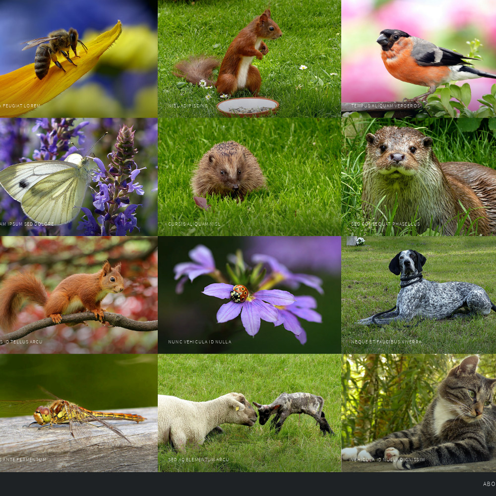
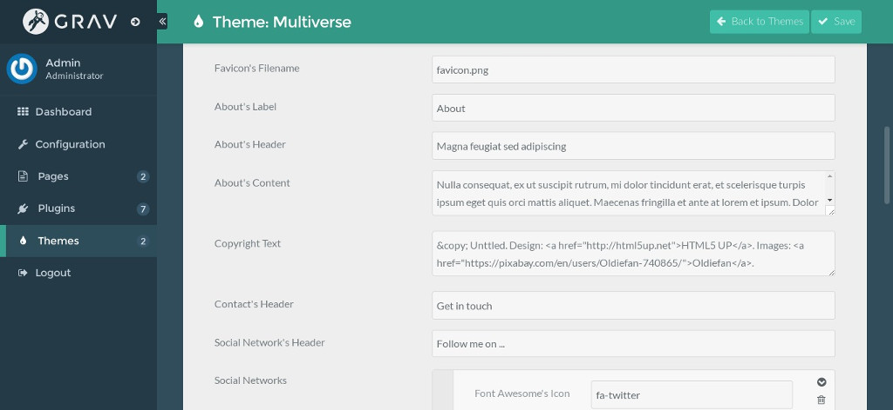
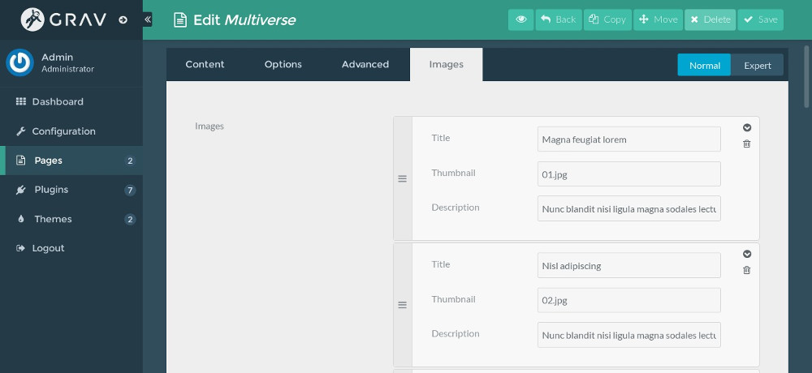

# Multiverse theme for Grav CMS



Multiverse theme is a port of [Multiverse](http://html5up.net/multiverse) by [HTML5 UP](http://html5up.net/).

# Features

* One page with contact form
* Fully responsive
* Built on HTML5/CSS3/[Skel](https://github.com/n33/skel)
* Font Awesome ready
* Released under [Creative Commons Attribution 3.0 License](http://html5up.net/license)

# Installation

## GPM Installation (Preferred)

The simplest way to install this theme is via the [Grav Package Manager (GPM)](http://learn.getgrav.org/advanced/grav-gpm) through your system's Terminal (also called the command line).  From the root of your Grav install type:

    bin/gpm install multiverse

This will install the Gateway theme into your `/user/themes` directory within Grav. Its files can be found under `/your/site/grav/user/themes/multiverse`.

## Manual Installation

To install this theme, just download the zip version of this repository and unzip it under `/your/site/grav/user/themes`. Then, rename the folder to `multiverse`.

You should now have all the theme files under

    /your/site/grav/user/themes/multiverse

>> NOTE: This theme is a modular component for Grav which requires the [Grav](http://github.com/getgrav/grav), [Error](https://github.com/getgrav/grav-theme-error), [Problems](https://github.com/getgrav/grav-plugin-problems), [Email](https://github.com/getgrav/grav-plugin-email) and [Form](https://github.com/getgrav/grav-plugin-form) plugins.

# Setup

If you want to set Multiverse as the default theme, you can do so by following these steps:

* Navigate to `/your/site/grav/user/config`.
* Open the **system.yaml** file.
* Change the `theme:` setting to `theme: multiverse`.
* Save your changes.
* Clear the Grav cache. The simplest way to do this is by going to the root Grav directory in Terminal and typing `bin/grav clear-cache`.

Once this is done, you should be able to see the new theme on the frontend. Keep in mind any customizations made to the previous theme will not be reflected as all of the theme and templating information is now being pulled from the **multiverse** folder.

## Configure the theme

The theme has configuration options which you need to setup. Create the file `your/site/grav/user/config/themes/multiverse.yaml` with the following content, feel free to adjust to suit your needs:

```
enabled: true
about_label: About
about_header: 'Welcome!'
about_content: 'Welcome to my website!'
copyright: '&copy; My Name'
social_networks:
  -
    icon: fa-twitter
    label: Twitter
    url: 'https://www.twitter.com/'
  -
    icon: fa-facebook
    label: Facebook
    url: 'https://www.facebook.com/'
  -
    icon: fa-instagram
    label: Instagram
    url: 'https://www.instagram.com/'
  -
    icon: fa-github
    label: GitHub
    url: 'https://www.github.com/'
  -
    icon: fa-dribbble
    label: Dribbble
    url: 'https://www.dribbble.com/'
  -
    icon: fa-linkedin
    label: LinkedIn
    url: 'https://www.linkedin.com/'
contact_header: 'Get in touch'
social_header: 'Follow me on ...'
favicon: favicon.png
```

`favicon` is the name of an image in `your/site/grav/user/themes/multiverse/images` which you want to use as your site's favicon, `favicon.png` is used by default.

If you have [Admin plugin](https://github.com/getgrav/grav-plugin-admin) installed, you can edit these options when you edit the theme's settings.



## Add images

Rename the name of your home's file to `home.md`, upload images to its folder, you can use the sample content below to get ideas of how to add images to your page and setup the contact form:

```
---
title: Multiverse
images:
    -
        thumbnail: 01.jpg
        title: Magna feugiat lorem
        description: Nunc blandit nisi ligula magna sodales lectus elementum non. Integer id venenatis velit.
    -
        thumbnail: 02.jpg
        title: Nisl adipiscing
        description: Nunc blandit nisi ligula magna sodales lectus elementum non. Integer id venenatis velit.
    -
        thumbnail: 03.jpg
        title: Tempus aliquam veroeros
        description: Nunc blandit nisi ligula magna sodales lectus elementum non. Integer id venenatis velit.
    -
        thumbnail: 04.jpg
        title: Aliquam ipsum sed dolore
        description: Nunc blandit nisi ligula magna sodales lectus elementum non. Integer id venenatis velit.
    -
        thumbnail: 05.jpg
        title: Cursis aliquam nisl
        description: Nunc blandit nisi ligula magna sodales lectus elementum non. Integer id venenatis velit.
    -
        thumbnail: 06.jpg
        title: Sed consequat phasellus
        description: Nunc blandit nisi ligula magna sodales lectus elementum non. Integer id venenatis velit.

form:
    action: /home
    name: contact-form
    fields:
        - name: name
          label: Name
          placeholder: Name
          type: text
          validate:
            required: true
        - name: email
          label: Email
          placeholder: Email
          type: email
          validate:
            required: true
        - name: message
          label: Message
          placeholder: Message
          type: textarea
          rows: 4
          validate:
            required: true
    buttons:
        - type: submit
          value: Send
          classes: special
        - type: reset
          value: Reset
    process:
        - email:
            from: "{{ config.plugins.email.from }}"
            to:
              - "{{ config.plugins.email.from }}"
            subject: "[Contact] Message from {{ form.value.name|e }}"
            body: ""
        - save:
            fileprefix: contact-
            dateformat: Ymd-His-u
            extension: txt
            body: ""
        - display: thank-you
---

```

With Admin plugin, you can manage the images easier.



# Updating

## GPM Update (Preferred)

The simplest way to update this theme is via the [Grav Package Manager (GPM)](http://learn.getgrav.org/advanced/grav-gpm). You can do this with this by navigating to the root directory of your Grav install using your system's Terminal (also called command line) and typing the following:

    bin/gpm update multiverse

This command will check your Grav install to see if your Gateway theme is due for an update. If a newer release is found, you will be asked whether or not you wish to update. To continue, type `y` and hit enter. The theme will automatically update and clear Grav's cache.

## Manual Update

Manually updating Multiverse is pretty simple. Here is what you will need to do to get this done:

* Delete the `your/site/user/themes/multiverse` directory.
* Download the new version of the Multiverse theme from this repository.
* Unzip the zip file in `your/site/user/themes` and rename the resulting folder to `multiverse`.
* Clear the Grav cache. The simplest way to do this is by going to the root Grav directory in terminal and typing `bin/grav clear-cache`.

> Note: Any changes you have made to any of the files listed under this directory will also be removed and replaced by the new set. Any files located elsewhere (for example a YAML settings file placed in `user/config/themes`) will remain intact.
